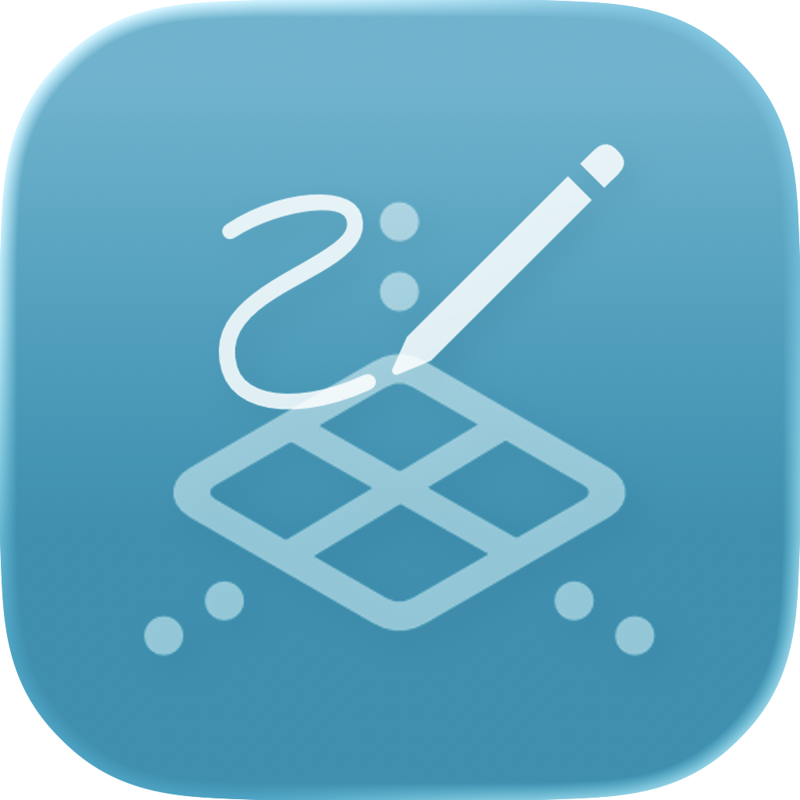
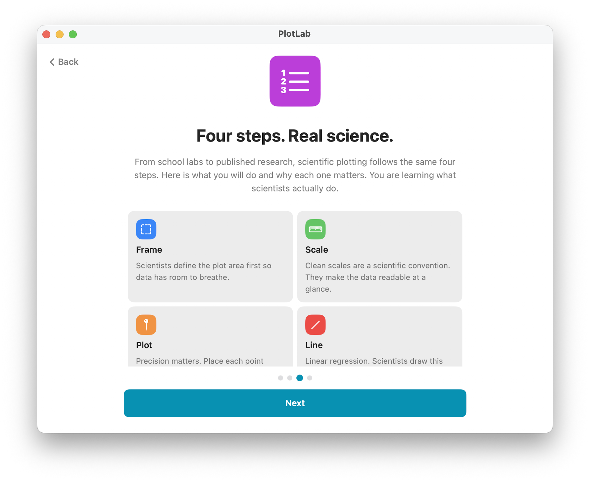
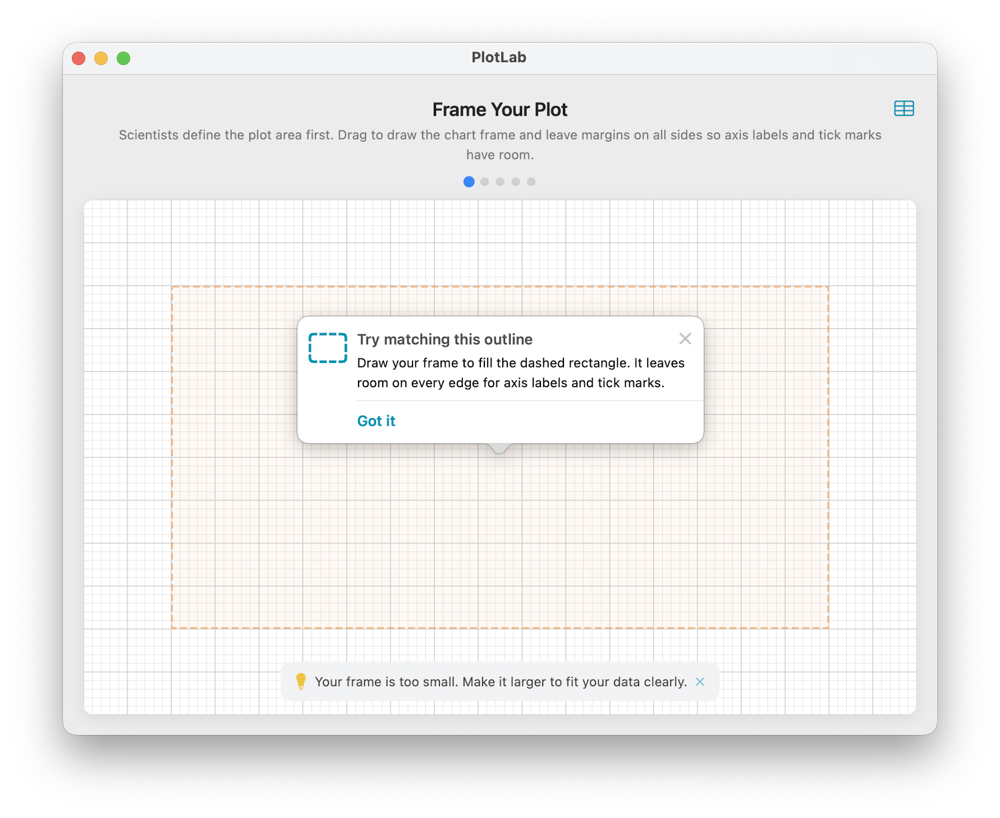
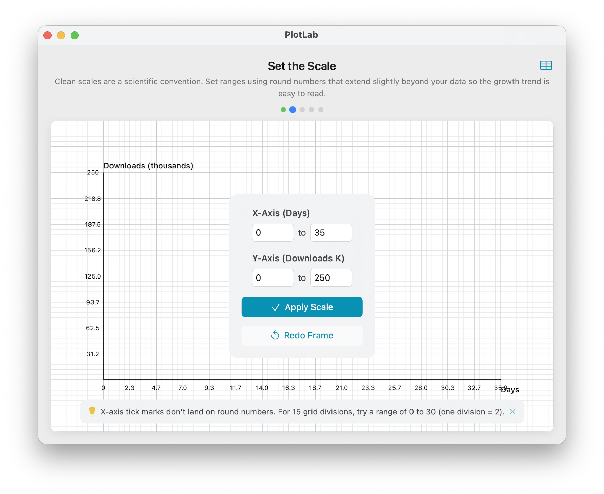
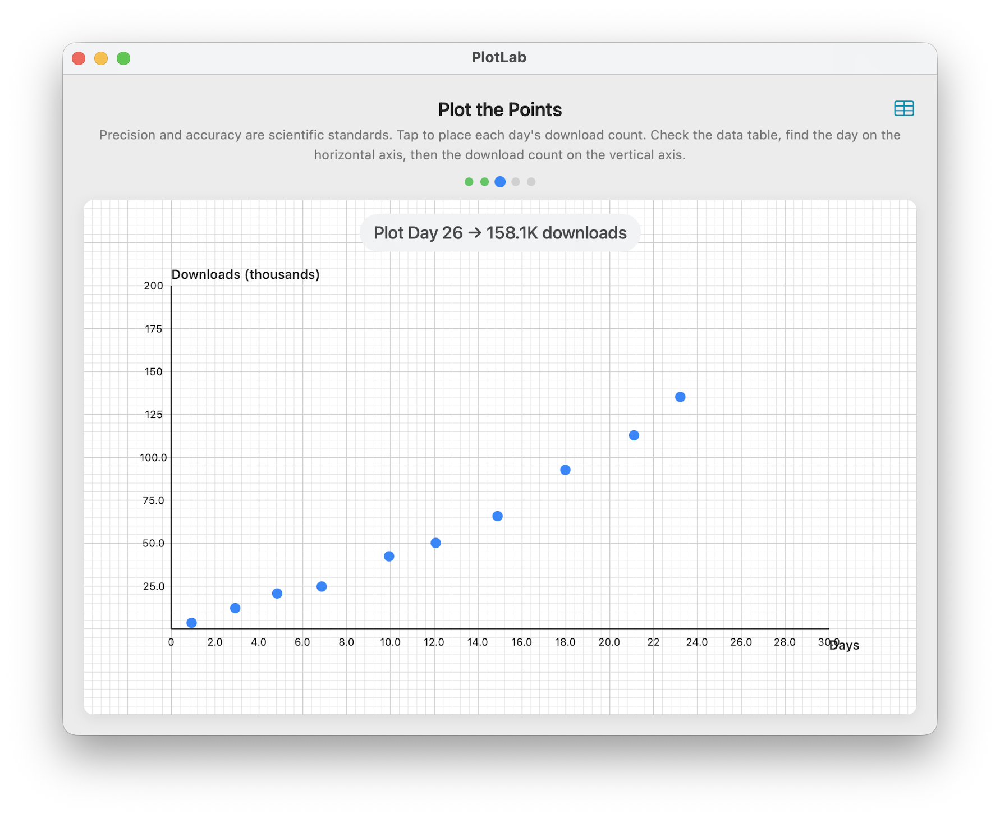

<div align="center">

<!-- Add your app icon here -->


# PlotLab

An interactive iPad app for learning scientific data plotting, built with Swift and SwiftUI.

[](https://swift.org)
[](https://developer.apple.com/ipados/)
[](https://developer.apple.com/swift-student-challenge/)
[](https://github.com/oadultradeepfield/PlotLab/blob/main/LICENSE)

[Report Bug](https://github.com/oadultradeepfield/PlotLab/issues) · [Request Feature](https://github.com/oadultradeepfield/PlotLab/issues)

</div>

---

## Table of Contents

- [About](#about)
- [Screenshots](#screenshots)
- [Tech Stack](#tech-stack)
- [Features](#features)
- [Getting Started](#getting-started)
- [Usage](#usage)
- [Learning](#learning)
- [Contributing](#contributing)
- [License](#license)

## About

PlotLab teaches students how to construct and read scientific scatter plots. A five-phase tutorial guides learners through the full workflow: defining the plot area, selecting a scale, placing data points, and drawing a best-fit line. Each phase validates the student's input and returns specific, actionable feedback before advancing.

The app uses a real-world dataset of mobile app downloads over 30 days, giving students a concrete context for practising scientific plotting conventions.

## Screenshots

|                    Onboarding Screen                     |                      Frame Phase                       |
|:--------------------------------------------------------:|:------------------------------------------------------:|
|       |          |
|                  **Plot Points Phase**                   |                  **Draw Line Phase**                   |
|  |  |

## Tech Stack

- [Swift](https://swift.org/) 6.2 with strict concurrency
- [SwiftUI](https://developer.apple.com/xcode/swiftui/) - declarative UI framework
- [Swift Playgrounds 4](https://developer.apple.com/swift-playgrounds/) - app format and distribution target
- [@Observable](https://developer.apple.com/documentation/observation) - state management macro (Swift 5.9+)
- [TipKit](https://developer.apple.com/documentation/tipkit) - contextual tips and onboarding popovers

## Features

- Five-phase guided tutorial covering the full graph-construction workflow
- Real-time hint cards with specific feedback for each validation failure
- Friendly-scale enforcement: tick marks always land on round numbers
- Per-point accuracy checking against a tolerance of one minor grid square
- Best-fit line validation using ordinary least squares regression
- Interactive data table available during point placement
- Frame guide overlay with TipKit popover after repeated failed frame attempts
- Insight tips sequence after completion explaining graphs, regression, and real-world science
- Full VoiceOver support with descriptive accessibility labels and hints
- Apple Pencil support for precise input

## Getting Started

### Requirements

- iPad running iPadOS 18.0 or later
- [Swift Playgrounds 4](https://apps.apple.com/app/swift-playgrounds/id908519492) (free on the App Store)

### Opening the Project

1. Clone the repository.

```bash
git clone https://github.com/oadultradeepfield/PlotLab.git PlotLab.swiftpm
```

2. Open `PlotLab.swiftpm` in Swift Playgrounds on iPad or in Xcode 16 on macOS.
3. Tap **Run My App** to build and launch.

The project requires no additional dependencies or package installations.

## Usage

PlotLab guides you through five sequential phases. Each phase must pass validation before you can advance.

### Phase 1: Frame Your Plot

Drag on the grid to define the rectangular area where your graph will live. The frame must be large enough to fit all data points and must leave space along each edge for axis labels.

### Phase 2: Set the Scale

Enter minimum and maximum values for each axis. The app checks that all data points fall within the range and that the chosen interval produces round tick marks.

### Phase 3: Plot the Points

Tap each data point onto the grid in the order shown. A hint card confirms each placement and flags any point that falls outside the one-minor-square accuracy threshold. Open the data table at any time to check coordinate values.

### Phase 4: Draw Best-Fit Line

Drag across the grid to draw a straight line through the scatter. The app validates the line against a linear regression: slope must match within 15 percent, the line must pass near the data centroid, and roughly equal numbers of points must fall on each side.

### Phase 5: Completion

A summary screen confirms that all phases passed. A sequence of TipKit insight popovers then walks through what the graph means, how the best-fit line predicts future values, and where scientific plotting appears in the real world.

## Learning

Two mechanics underpin the interactive grid and together they represent the most technically interesting parts of the app.

### Friendly-Scale Tick Construction

When you enter an axis range, the app must choose tick mark positions that land on round numbers. A "friendly interval" belongs to the set `{1, 2, 2.5, 5}` scaled by any power of ten: for example, 0.5, 1, 2, 2.5, 5, 10, 20, 25, and so on.

Given your chosen min and max, the app works through every candidate interval in ascending order and selects the smallest one that satisfies two conditions:

1. The ticks span at least 50 percent of the framed axis length (so the graph does not look empty).
2. The ticks span no more than 95 percent of the framed axis length (so no data point sits on or beyond the edge).

The resulting interval guarantees that every tick label reads as a clean number, which is a standard convention in scientific publication. If no friendly interval fits within those bounds, the validator returns a hint asking you to widen or narrow the range.

### Snap-to-Grid

When you drag to frame the plot area in Phase 1, the corner of the frame snaps to the nearest intersection on the background grid. This behavior relies on a coordinate transformer that maps between two spaces throughout the app.

**Screen space** measures positions in points (UIKit/SwiftUI units) relative to the top-left corner of the grid view.

**Data space** measures positions in the axis units you chose in Phase 2 (for example, days on the x-axis, downloads on the y-axis).

The transformer computes the mapping linearly:

```
screenX = frameOriginX + (dataX - axisMinX) / (axisMaxX - axisMinX) * frameWidth
screenY = frameOriginY + (1 - (dataY - axisMinY) / (axisMaxY - axisMinY)) * frameHeight
```

The y-axis inverts because screen coordinates increase downward while data values increase upward. Every tapped point, every drawn line endpoint, and every tick label position passes through this transformer, keeping all layers of the grid consistent.

Snap-to-grid itself runs the inverse direction: a raw drag position converts to the nearest grid-line index and then back to screen coordinates. This produces the clean, snapped corners you see when you frame the plot.

## License

Distributed under the MIT License. See [`LICENSE`](LICENSE) for more information.
